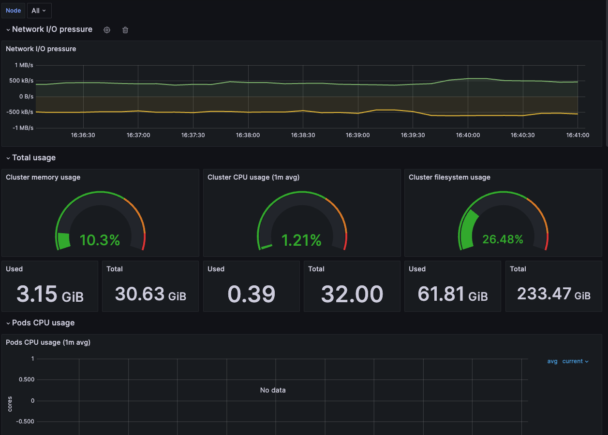

# K8-Grafana-Prometheus-Learning-Server



This repo is used to track my learning of setting up and application use of data source from node to Grafana through Prometheus. This guide will walk you through my devsecops learning journey. For this project, we will be using kind instead of minikube. As for the version of kindest/node to integrate, kindly check on the compactibility matrix on the `kube-prometheus` repo [here](https://github.com/prometheus-operator/kube-prometheus)

## Step 1: Create a Kubernetes Cluster

1. **Navigate to the project directory:**

    ```sh
    cd K8-Grafana-Prometheus-Learning-Server
    ```

2. **Create the cluster using `kind`:**

    ```sh
    kind create cluster --name monitoring --image kindest/node:v1.28.9 --config kind.yaml
    ```

3. **Verify the cluster setup:**

    ```sh
    kubectl get nodes
    ```

    You should see output similar to:

    ```sh
    NAME                       STATUS   ROLES                  AGE   VERSION
    monitoring-control-plane   Ready    control-plane,master   76s   v1.28.9
    monitoring-worker          Ready    <none>                 34s   v1.28.9
    monitoring-worker2         Ready    <none>                 35s   v1.28.9
    monitoring-worker3         Ready    <none>                 35s   v1.28.9
    ```

## Step 2: Set Up Kube Prometheus

1. **Pull the required `kube-prometheus` release using Docker:**

    ```sh
    docker run -it -v ${PWD}:/work -w /work alpine sh
    apk add git
    ```

2. **Clone the `kube-prometheus` repository:**

After checking on the compatibility matrix, we have checked that Kubernetes V1.28.9 will work with only `release-0.13`. Thus, lets start cloning into the specific version.

    ```sh
    git clone --depth 1 https://github.com/prometheus-operator/kube-prometheus.git -b release-0.13 /tmp/
    ```

3. **Copy the manifests from the temporary folder:**

    ```sh
    cp -R /tmp/manifests .
    exit
    ```

## Step 3: Deploy Prometheus Operator and Custom Resource Definitions (CRDs)

1. **Create the CRDs and deploy the Prometheus operator:**

    ```sh
    kubectl create -f ./manifests/setup/
    ```

2. **Apply the remaining manifests:**

    ```sh
    kubectl create -f ./manifests/
    ```

## Step 4: Verify the Monitoring Setup

1. **Check the status of the monitoring pods:**

    ```sh
    kubectl -n monitoring get pods
    ```

    You should see output similar to:

    ```sh
    NAME                                   READY   STATUS    RESTARTS   AGE
    alertmanager-main-0                    2/2     Running   0          26m
    alertmanager-main-1                    2/2     Running   0          26m
    alertmanager-main-2                    2/2     Running   0          26m
    blackbox-exporter-6cfc4bffb6-tj28g     3/3     Running   0          27m
    grafana-748964b847-ndg7f               1/1     Running   0          27m
    kube-state-metrics-6b4d48dcb4-w2hmm    3/3     Running   0          27m
    node-exporter-7frf2                    2/2     Running   0          27m
    node-exporter-7mmzn                    2/2     Running   0          27m
    node-exporter-8twg7                    2/2     Running   0          27m
    node-exporter-f9nrj                    2/2     Running   0          27m
    prometheus-adapter-79c588b474-hl59s    1/1     Running   0          27m
    prometheus-adapter-79c588b474-vl928    1/1     Running   0          27m
    prometheus-k8s-0                       2/2     Running   0          26m
    prometheus-k8s-1                       2/2     Running   0          26m
    prometheus-operator-68f6c79f9d-thgqf   2/2     Running   0          27m
    ```

## Step 5: Access Grafana Dashboards

1. **Port-forward to access Grafana:**

    ```sh
    kubectl -n monitoring port-forward svc/grafana 3000
    ```

2. **Access Grafana in your browser:**

    Open [http://localhost:3000](http://localhost:3000)


## Step 6: Check Prometheus

1. **Port-forward to access Prometheus:**

    ```sh
    kubectl -n monitoring port-forward svc/prometheus-operated 9090
    ```

2. **Access Prometheus in your browser:**

    Open [http://localhost:9090](http://localhost:9090)

## Step 8: Check Service Monitors

1. **List the service monitors:**

    ```sh
    kubectl -n monitoring get servicemonitors
    ```

2. **Describe a specific service monitor:**

    ```sh
    kubectl -n monitoring describe servicemonitor node-exporter
    ```

    This will show how Prometheus is configured to scrape metrics.

After these are configured, it will be where the fun part starts! We will be able to customize the dashboard according to our needs or even look for templates available on hub to integrate. 